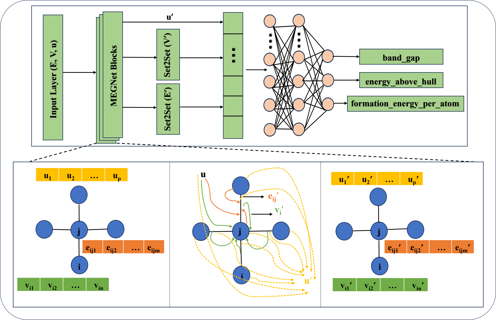

# Operations-Research-Guided-Graph-Neural-Networks-for-Multi-Property-Regression-in-Materials-Science
This repository contains the code and data used in the study "Operations-Research-Guided-Graph-Neural-Networks-for-Multi-Property-Regression-in-Materials-Science".  We used a Materials Graph Network (MEGNet) architecture, as shown in figure below, to predict material properties like band gap (Eg), formation energy (Ef), and energy above hull (E_hull).

## Overview
This project demonstrates the application of MEGNet for predicting key material properties using structural information from the Materials Project Database (MPD).  We employed hyperparameter optimization (HPO) techniques, specifically Genetic Algorithm (GA) and Simulated Annealing (SA), to fine-tune the MEGNet model for improved prediction accuracy.

## Key Features
*   **Graph-based Material Representation:** Utilizes the CrystalGraph class from the MEGNet library to represent materials as graphs, capturing atomic connectivity and bonding interactions.
*   **Multi-Property Prediction:** Simultaneously predicts band gap (Eg), formation energy (Ef), and energy above hull (E_hull).
*   **Hyperparameter Optimization:** Implements GA and SA algorithms to optimize MEGNet hyperparameters for enhanced performance.
*   **Comprehensive Evaluation:** Evaluates model performance using Mean Absolute Error (MAE), R-squared (R²), and Pearson correlation coefficient (ρ).

## Data
The dataset used in this study is a subset of the MPD, consistent with the selection used by Chen et al. \[[chen2019graph](https://arxiv.org/abs/1812.05055)]. Due to its size, the dataset is not included directly in this repository. However, the corresponding material IDs are provided in the "material_ids.txt" file for reference.

